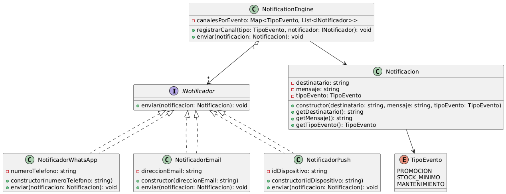

StrategyTS – Implementación del Patrón Strategy en TypeScript

Este proyecto implementa un módulo de notificaciones flexible utilizando el Patrón de Diseño Strategy, permitiendo enviar mensajes por diferentes canales (WhatsApp, Email y Push) sin necesidad de modificar el motor principal del sistema.

Es una solución ideal para aplicaciones donde los tipos de notificación deben ser extensibles, mantenibles y de bajo acoplamiento.

🚀 Objetivo del Proyecto

Implementar un sistema de notificaciones donde, según el tipo de evento, el sistema pueda usar una o varias estrategias de envío (WhatsApp, Email, Push).
Todo esto aplicando Patrón Strategy, lo que permite:

Agregar nuevos canales sin cambiar código existente

Reducir condicionales (if/switch)

Mejorar la escalabilidad

Mantener un diseño limpio y modular

📁 Estructura del Proyecto
StrategyTS/
 ├─ dist/                   # Código compilado a JavaScript
 ├─ src/                    # Código fuente en TypeScript
 │   ├─ engine/             # Motor de notificaciones
 │   │     └─ NotificationEngine.ts
 │   ├─ models/             # Modelos del dominio
 │   │     ├─ Notificacion.ts
 │   │     └─ TipoEvento.ts
 │   └─ strategies/         # Estrategias concretas (Strategy Pattern)
 │         ├─ INotificador.ts
 │         ├─ NotificadorWhatsApp.ts
 │         ├─ NotificadorEmail.ts
 │         └─ NotificadorPush.ts
 ├─ diagramaNotificacion.png  # Diagrama UML del sistema
 ├─ package.json
 ├─ tsconfig.json
 └─ README.md

🧠 Patrón Strategy Implementado

El proyecto aplica el Patrón Strategy, donde:

🔹 Estrategia (Strategy)

INotificador
Define el método genérico enviar().

🔹 Estrategias Concretas (Concrete Strategies)

NotificadorWhatsApp

NotificadorEmail

NotificadorPush

Cada clase implementa una forma distinta de enviar una notificación.

🔹 Contexto (Context)

NotificationEngine
Administra qué canales deben ejecutarse según el evento recibido.

🔹 Modelo de Datos

Notificacion y TipoEvento
Describen la estructura de la información que se enviará.

📌 Diagrama UML

El diagrama UML del sistema se encuentra en:

📄 diagramaNotificacion.png

Muestra:

La interfaz INotificador

Las estrategias concretas

El motor NotificationEngine

Las relaciones entre clases

El modelo Notificacion y el enum TipoEvento

🛠️ Tecnologías Utilizadas

TypeScript

Node.js

Patrón de Diseño Strategy

PlantUML

Git & GitHub

▶️ Cómo Ejecutar el Proyecto
1️⃣ Instalar dependencias
npm install

2️⃣ Compilar TypeScript
npm run build

3️⃣ Ejecutar el programa
npm start

La consola mostrará qué canales envían las notificaciones según el tipo de evento configurado.

📬 Ejemplo de salida
[WhatsApp] Enviando a +51 999 999 999. Mensaje: ¡Nueva promoción! 20% de descuento...
[Email] Enviando a bodeguero@chamarket.com...
[Push] Enviando a dispositivo DEVICE-12345...

🧩 Cómo agregar un nuevo canal de notificación

Crear una clase que implemente INotificador

Implementar el método enviar()

Registrar el nuevo canal en el motor:

engine.registrarCanal(TipoEvento.PROMOCION, new NotificadorSMS("+51900000000"));

¡Y listo!
No es necesario modificar el motor ni las otras clases.

✨ Autor

Proyecto desarrollado por Salvatierra2023
Aplicando buenas prácticas de diseño de software y patrones de diseño.
